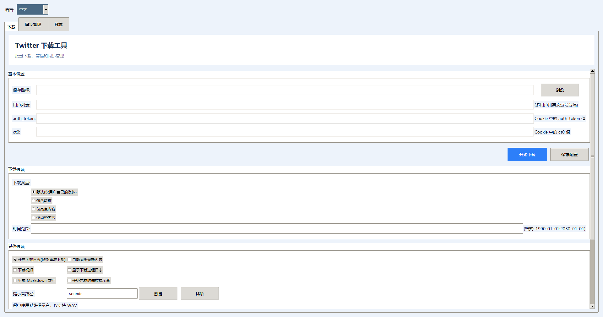
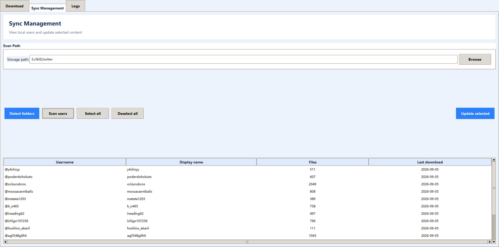
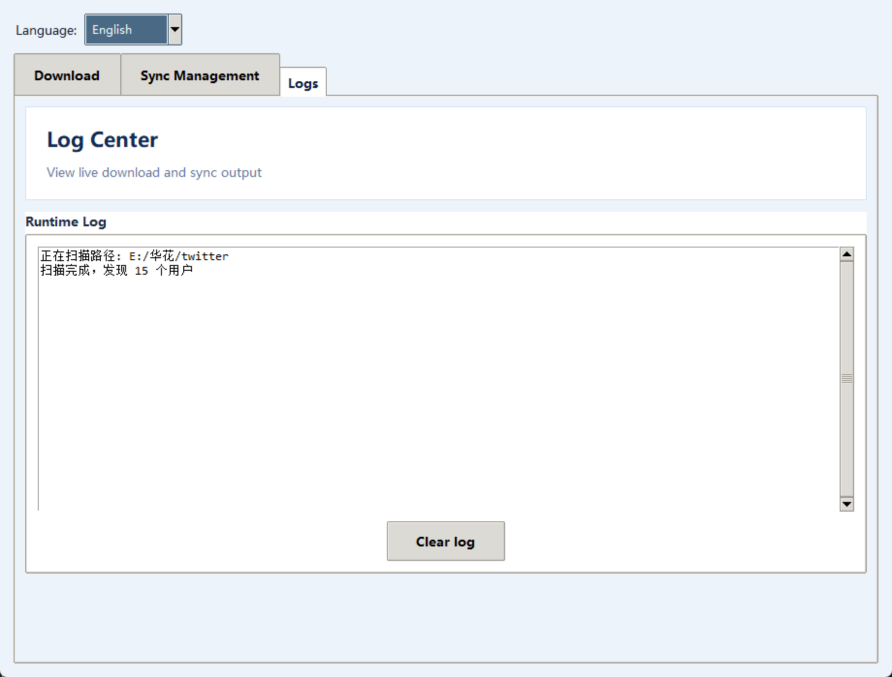

# Twitter Download

English documentation: [README_EN.md](README_EN.md) | Technical documentation: [TECHNOLOGY_EN.md](TECHNOLOGY_EN.md)

当前仓库地址：[yuhujijijj/Twitter-Download-X-twitter-](https://github.com/yuhujijijj/Twitter-Download-X-twitter-)

一个基于 Python 的 Twitter/X 媒体、文本、标签和评论下载工具，支持 GUI、批量用户、时间范围、断点同步以及 CSV/Markdown 输出。

支持排除转推内容、多用户下载、时间范围限制、按标签搜索、纯文本下载、高级搜索和评论区下载。

## 当前版本已完成

- GUI 支持中文/英文切换，语言选择会保存到配置文件。
- 下载地址必须通过“浏览”选择并保存，不再静默使用当前目录。
- Cookie 在 GUI 中拆分为 `auth_token` 和 `ct0` 两个独立输入框，也支持 `TWITTER_COOKIE` 环境变量。
- 小窗口模式下下载页面支持完整内容显示和鼠标滚轮滚动。
- 支持任务完成提示音、默认 `sounds/default.wav`、自定义 WAV 文件和“试听”功能。
- Windows 用户可在项目根目录通过 `TwitterDownload.spec` 自行构建 EXE；目前仓库不提供预编译 ZIP/Release 附件。
- 已加入中英文 README、技术文档、示例配置和 GitHub 发布安全规则。

## 项目来源与致谢

本项目的整体代码结构、核心功能和大部分实现均来自用户 **[caolvchong-top](https://github.com/caolvchong-top)** 的原始项目 [twitter_download](https://github.com/caolvchong-top/twitter_download)。感谢原作者的开发与开源分享。

当前仓库是在上述项目基础上的个人整理与维护版本，包含配置安全、依赖声明、GUI 和文档等方面的调整。除非另有说明，本项目不主张拥有原始项目代码的独立著作权；使用、修改和再发布时请同时遵守原项目的许可证及相关条款。

## 快速开始

```bash
git clone https://github.com/yuhujijijj/Twitter-Download-X-twitter-.git
cd Twitter-Download-X-twitter-
python -m venv .venv
# Windows: .venv\\Scripts\\activate
# Linux/macOS: source .venv/bin/activate
python -m pip install -r requirements.txt
```

复制 `settings.example.json` 的内容到 `settings.json`，然后必须在 GUI 中点击“浏览”选择一个已存在的下载文件夹，并保存配置。程序不会在未选择路径时自动使用当前目录。填写用户名后即可开始下载。Cookie 推荐通过环境变量提供：

```bash
# Windows CMD
set TWITTER_COOKIE=auth_token=...; ct0=...;
# PowerShell
$env:TWITTER_COOKIE = "auth_token=...; ct0=...;"
```

然后运行 `python main.py`，或运行 `python gui.py` 使用图形界面。

### Windows EXE 构建

在 Windows 项目根目录打开 PowerShell，安装项目依赖和 PyInstaller，然后运行 spec：

```powershell
python -m pip install -r requirements.txt
python -m pip install pyinstaller
python -m PyInstaller --clean --noconfirm TwitterDownload.spec
```

构建成功后，完整程序目录位于 `dist/app`。运行其中的 `TwitterDownload.exe`；分发到其他电脑时复制整个 `app` 文件夹，不要只复制 EXE。首次启动后在 GUI 中设置下载目录和 Cookie。打包配置会从 `settings.example.json` 生成不含个人 Cookie 的初始配置。该 spec 面向 Windows x64，应在 Windows 上构建。

在 GUI 的“其他选项”中勾选“任务完成时播放提示音”即可开启完成提醒；提示音路径默认为 `sounds`，点击“试听”可以提前播放，提示音文件可通过“浏览”选择自定义 `.wav` 文件，留空时使用 Windows 系统提示音。

---
**目前老马加了API的请求次数限制** 
``` 
当程序抛出：Rate limit exceeded 
即表示该账号当日的API调用次数已耗尽

if 选择包含转推:
  爬完一个用户需要调用的API次数约为:总推数(含转推) / 19
elif 不包含:
  会大大减少API调用次数

下载不计入次数 
```

---

<div align="center"> 

|  |
|:--:| 
| **(๑´ڡ`๑)** | 

</div>

部署
--- 

> 当前仓库地址为 [yuhujijijj/Twitter-Download-X-twitter-](https://github.com/yuhujijijj/Twitter-Download-X-twitter-)，原始项目地址为 [caolvchong-top/twitter_download](https://github.com/caolvchong-top/twitter_download)。

**Linux** : 
``` 
git clone https://github.com/yuhujijijj/Twitter-Download-X-twitter-.git
cd Twitter-Download-X-twitter-
pip3 install -r requirements.txt

#Python版本须>=3.8  httpx==0.28.1
``` 
**运行** : 
``` 
配置settings.json文件
python3 main.py 
``` 
**Windows** 和上面的一样，配置完setting.json后运行main.py即可 


注意事项
---

**按Tag下载&高级搜索 --> tag_down.py** 

**下载评论区 --> reply_down.py** 

**指定用户纯文本推文获取 --> text_down.py** 

**指定用户媒体文件获取&转推&亮点&喜欢(只能本人账号)等 --> main.py + settings.json** 

其余各种不能解决的需求建议试试tag_down的高级搜索, 或是提交Issue 


Tag_Down 功能扩展 (高级搜索) &nbsp;&nbsp; <sub>//万金油</sub> 
---
~~其实按功能应该叫`search_down`~~

对于部分主程序难以实现的需求可以尝试配置`tag_down.py`的`filter`来曲线解决: 

|部分例子|
|:--:|
|大批量下载 -> 分批下载|
|指定时间范围|
|各类关键词搜索/排除|
|指定/排除目标用户|
|指定大于互动量的推文|
|指定推文语言|
|......| 

``` 
// 配置

tag = '#ヨルクラ'
# 填入tag 带上#号 可留空
_filter = ""
# (可选项) 高级搜索
# 请在 https://x.com/search-advanced 中组装搜索条件，复制搜索栏的内容填入_filter
# 注意，_filter中所有出现的双引号都需要改为单引号或添加转义符 例如 "Monika" -> 'Monika'

# 当tag选项留空时，将尝试以_filter的内容作为文件夹名称
``` 
推特高级搜索：https://x.com/search-advanced 

实例参考：https://github.com/caolvchong-top/twitter_download/issues/63#issuecomment-2351039320 & https://github.com/caolvchong-top/twitter_download/issues/106


当前界面效果
---
**下载界面（中文）**



**同步管理**



**日志中心**



以下为原项目的历史效果图，仅作功能参考。

## 原项目历史效果参考

 


**↑↑老版本的图，仅效果参考**


**评论区下载 Reply_down.py** 


 
**按Tag获取 Tag_down.py** 


**纯文本推文获取(仅文本) Text_down.py** 


**图片下载效果**


**视频下载效果**


**生成CSV统计**


