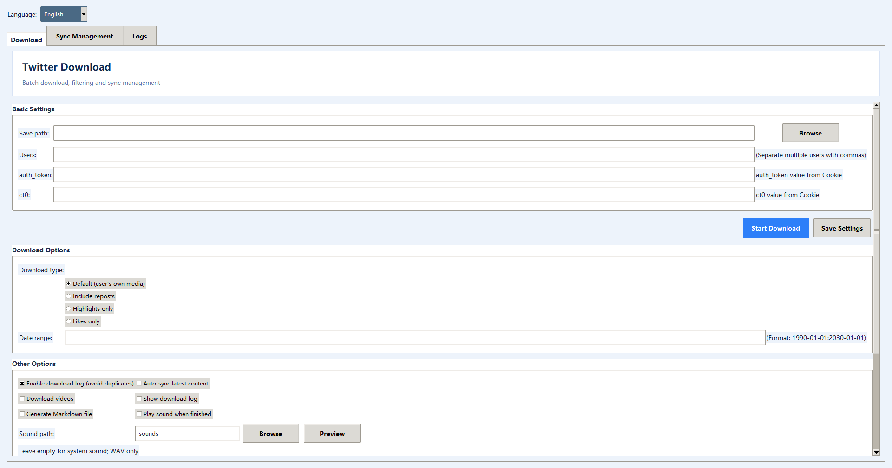

# Twitter Download

Repository: [yuhujijijj/Twitter-Download-X-twitter-](https://github.com/yuhujijijj/Twitter-Download-X-twitter-)

A Python GUI and command-line tool for downloading media, text, hashtag results, replies, and profile data from Twitter/X.

> **Attribution**
>
> The overall code structure, core features, and most implementations are based on the original open-source project by [caolvchong-top](https://github.com/caolvchong-top): [twitter_download](https://github.com/caolvchong-top/twitter_download). This repository is a personally maintained and organized version with configuration-safety, GUI, packaging, and documentation updates. Please follow the original project's license and terms when using or redistributing the code.

## Features

- Batch downloads for multiple users
- Images, videos, text, reposts, highlights, and likes
- Date-range filtering and incremental synchronization
- Hashtag and advanced search downloads
- Reply and profile downloads
- CSV and Markdown output
- Tkinter GUI and Windows executable
- Optional completion sound with WAV preview and custom sound selection
- Chinese and English GUI language selection

## Completed Improvements

- Chinese/English GUI language switching with a persisted setting
- Required download-folder selection; the application never silently falls back to the current directory
- Separate `auth_token` and `ct0` Cookie fields, plus `TWITTER_COOKIE` environment-variable support
- Full content visibility and mouse-wheel scrolling in small-window mode
- Completion sound support with bundled `sounds/default.wav`, custom WAV selection, and preview
- Download the Windows executable package from [GitHub Releases](https://github.com/yuhujijijj/Twitter-Download-X-twitter-/releases/latest). Extract the archive and run `app/TwitterDownload.exe`; configure the download folder and Cookie on first use.
- Chinese and English README files, technical documentation, sample configuration, and GitHub safety rules

## Quick Start

```bash
git clone https://github.com/yuhujijijj/Twitter-Download-X-twitter-.git
cd Twitter-Download-X-twitter-
python -m venv .venv
# Windows: .venv\\Scripts\\activate
# Linux/macOS: source .venv/bin/activate
python -m pip install -r requirements.txt
python gui.py
```

Windows users can download and extract the release ZIP from [GitHub Releases](https://github.com/yuhujijijj/Twitter-Download-X-twitter-/releases/latest), then run `app/TwitterDownload.exe`. Keep all files in the `app` folder together. Select a download folder and configure the Cookie in the GUI on first use.

Copy `settings.example.json` to `settings.json`. Before the first download, click **Browse** in the GUI and select an existing download folder. The application intentionally does not fall back to the current directory.

Set the Cookie either in the GUI using separate `auth_token` and `ct0` fields, or with an environment variable:

```powershell
$env:TWITTER_COOKIE = "auth_token=...; ct0=...;"
```

Use the **Language** selector at the top of the GUI to choose Chinese or English. The selection is saved in `settings.json` and applies immediately.

## Completion Sound

Enable **Play sound when finished** in the Other Options section. The default path is `sounds`, which uses `sounds/default.wav`. Click **Preview** to test it before downloading. You can replace the default WAV file or select another WAV file with **Browse**.

## Interface Preview

**Download window (English)**



**Sync Management**


**Log Center**


See [TECHNOLOGY_EN.md](TECHNOLOGY_EN.md) for the architecture and configuration reference.
